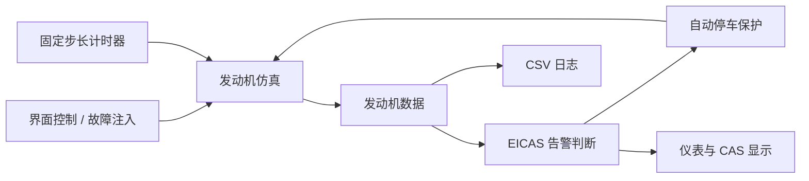

# Engine EICAS Simulator


本项目为2024级 同济大学国豪精英班高级语言程序设计（进阶）期末项目

一个基于 C++ 与 EasyX 的双发航空发动机 EICAS（发动机指示与机组警告系统）仿真程序。项目以图形化仪表展示发动机转速、排气温度、燃油流量与剩余油量，并支持发动机控制、故障注入、分级告警、自动停车保护和运行日志记录。

## 功能特性

- 模拟双发 N1 转速、EGT 排气温度、燃油流量和燃油余量
- 实现 `OFF`、`STARTING`、`RUNNING`、`STOPPING` 发动机状态流转
- 使用 5 ms 固定时间步长更新仿真数据
- 提供发动机启动、停车、增加推力和减小推力控制
- 支持 14 类传感器及参数超限故障注入
- 按咨询、注意、警告三级显示 EICAS 信息
- 在严重故障出现时触发自动停车保护
- 自动生成包含运行数据与告警事件的 CSV 日志

## 运行界面

程序窗口大小为 `1024 × 768`，主要区域包括：

- 左、右发动机 N1 转速表
- 左、右发动机 EGT 温度表
- 燃油流量与燃油余量信息
- 发动机启动和运行状态指示灯
- 发动机控制按钮
- 故障注入面板
- CAS 告警信息列表

## 环境要求

- Windows 10 或 Windows 11
- Visual Studio 2022
- 使用“使用 C++ 的桌面开发”工作负载
- MSVC v143 工具集
- Windows 10 SDK
- [EasyX 图形库](https://easyx.cn/)

项目同时包含 `Win32` 和 `x64` 的 Debug、Release 配置。

## 快速开始

### 1. 获取项目

克隆或下载本仓库，并进入包含 `Engine.sln` 的项目根目录。

### 2. 配置 EasyX

安装 EasyX，并确认其已集成到当前 Visual Studio 2022 环境。项目需要使用 EasyX 提供的 `graphics.h` 头文件及对应链接库。

### 3. 编译运行

使用 Visual Studio：

1. 打开 `Engine.sln`
2. 选择 `Debug` 或 `Release`
3. 选择 `x64` 或 `x86`
4. 按 `F5` 运行，或按 `Ctrl + F5` 启动但不调试

也可以在已配置 MSVC 环境的 Developer PowerShell 中编译：

```powershell
msbuild Engine.sln /p:Configuration=Release /p:Platform=x64
```

默认情况下，x64 Release 可执行文件生成在：

```text
x64/Release/Engine.exe
```

## 操作说明

| 控件 | 功能 |
| --- | --- |
| `ENGINE START` | 启动发动机 |
| `ENGINE STOP` | 停止发动机 |
| `THRUST +` | 在稳定运行状态下增加推力 |
| `THRUST -` | 在稳定运行状态下减小推力 |
| 故障按钮 | 注入对应的传感器故障或参数超限 |
| `Esc` | 退出程序 |

故障注入按钮说明：

| 按钮 | 模拟故障 |
| --- | --- |
| `N1_1 Fail` | 单个 N1 转速传感器故障 |
| `N1_ALL Fail` | 同一发动机的两个 N1 传感器故障 |
| `EGT_1 Fail` | 单个 EGT 温度传感器故障 |
| `EGT_ALL Fail` | 同一发动机的两个 EGT 传感器故障 |
| `Fuel Fail` | 燃油余量传感器故障 |
| `All Sens Fail` | 双发全部 EGT 传感器故障 |
| `Low Fuel` | 燃油余量过低 |
| `N1 >105` | N1 转速超过注意阈值 |
| `N1 >120` | N1 转速超过警告阈值 |
| `EGT WARN START` | 启动阶段 EGT 超过注意阈值 |
| `EGT ERROR START` | 启动阶段 EGT 超过警告阈值 |
| `EGT WARN RUN` | 稳态运行阶段 EGT 超过注意阈值 |
| `EGT ERROR RUN` | 稳态运行阶段 EGT 超过警告阈值 |
| `Fuel Leak` | 燃油流量超过阈值 |

当前版本每次只保存一种主动注入的故障。点击其他故障按钮会切换故障类型；如需恢复无故障状态，请重新启动程序。

## 告警规则

| 监控项 | 注意阈值 | 警告阈值 |
| --- | ---: | ---: |
| N1 转速 | `> 42,000 RPM`（105%） | `> 48,000 RPM`（120%） |
| 启动阶段 EGT | `> 850 °C` | `> 1,000 °C` |
| 运行阶段 EGT | `> 950 °C` | `> 1,100 °C` |
| 燃油余量 | `< 1,000 kg` | — |
| 燃油流量 | `> 50 kg/h` | — |

单个传感器异常显示咨询信息，同一发动机同类传感器全部失效显示注意信息，双发同类传感器全部失效显示警告信息。告警触发后会在界面中保留约 5 秒。

以下严重故障会触发自动停车：

- 双发同类传感器全部失效
- N1 转速超过警告阈值
- 启动或运行阶段 EGT 超过警告阈值

## 日志

程序启动时会在当前工作目录生成日志文件：

```text
log_YYYYMMDD_HHMMSS.csv
```

日志记录以下内容：

- 仿真时间
- 左、右发动机转速
- 左、右发动机 EGT
- 燃油流量
- 燃油余量
- EICAS 告警与自动停车事件

同一告警在 5 秒内不会被重复写入。

## 项目结构

```text
.
├── Engine.sln
└── Engine/
    ├── main.cpp            # 主循环与模块协调
    ├── Simulator.*         # 发动机状态及参数仿真
    ├── EICAS.*             # 故障判断与告警队列
    ├── UI.*                # EasyX 图形界面与鼠标输入
    ├── Logger.*            # CSV 数据及告警日志
    ├── Timer.*             # 固定时间步长计时器
    ├── DataStructrue.h     # 状态、故障枚举与数据结构
    └── Engine.vcxproj      # Visual Studio C++ 项目配置
```

## 核心流程



## 说明

本项目用于课程设计、图形界面编程和航空发动机监控逻辑演示，不应作为真实航空系统的设计或运行依据。
